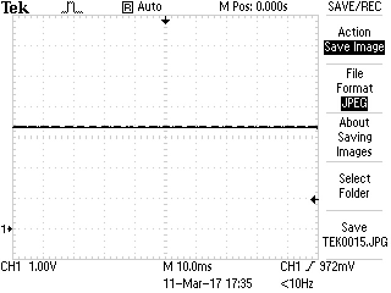

# EnergySampler
Wifi Detector PCBs
Memorandum Of Understanding – Wifi Detector (Energy Sampler)

# Table of Contents:

[Scope](#scope)  
[Introduction](#introduction)  
[Functionality](#functionality)  
[Hardware Setup](#hardware-setup)  
[Tuning ES-B](#tuning-es-b)  
[Tuning ES-A](#tuning-es-a)  
[Appendix-A](#appendix-a)  

## SCOPE
This MOU document is intended to capture the understanding of the “Wifi Detector (Energy Sampler)”. It provides information that can be used to confirm and challenge our common understanding.

## Introduction
As of 2016, LAB-401 has had developed three PCBs of type “Wifi Detector (Energy Sampler)”. These PCBs and commonly referred to as the “Energy Sampler” boards, and will be referred to as “ES” through this document.

PGS had the ES boards designed and manufactured by a third-party. The boards were received by LAB-401 in either 2016 or before. Currently there is only one document describing the ES boards, and that document is called “WiFi_Detector_Specifications.pdf”. An attempt to acquire additional design documents (schematic etc) has been made but to date nothing has been received.

The three ES PCBs all seem to be different, and images of each of the boards are shown in [Appendix-A](#appendix-a). Each board is given a name, either ES-A, ES-B or ES-C. The differences in the three boards is described in [Appendix-A](#appendix-a).

## FUNCTIONALITY
The general understanding of the function that these boards provide is as follows:  
*the ES can detect a WIFI signal, and asserts its output during the detection of WIFI.*

A typical setup of the ES would be:  
* PWR/GND should be applied to the two power pins,  
* an Antenna (or similar) should be connected to the RF connector,  
* an Oscilloscope (CRO) be connected to the output pins.  

The ES has three tuning potentiometers (POTs). A description of the function of each of these POTs can be found in “WiFi_Detector_Specifications.pdf”. This MOU document will provide details on what is observed when adjusting these POTs.

The POTS are identified from Left to Right as RED, GREEN and BLUE.  

One POT is shown below.

  

Each POT can rotate approx 270-degrees. For ease of understanding, we will define the positions of the POT as shown in the figure below.

  

This suggests that the POT shown above is at position 7.

## HARDWARE SETUP
An experiment has been performed to unit-test the ES-B PCB. The following connections were made:
* 3.3V and GND applied to the power-pins using benchtop power supply,
* nothing connected to the RF connector,
* CRO connected to the output-pins,
* three POTs turned to position 4.

The CRO showed:  
 Fig #1  
 Fig #2  

From Fig-1 and Fig-2, the output signal is seen to be a pulse of an undetermined frequency. The frequency will be looked into later. Of interest is that the amplitude of the output signal was approximately the same as the input voltage, ie 3.3V.

It is also noted that the output signal does not fall to GND, but swings from about 0.1V to about 3V.

The input voltage was varied carefully between 2.9V and 5.2V, to see if the amplitude of the output signal will follow the amplitude of the input voltage.
NOTE that the specifications on input voltage are min=2.7V, typ=3.3V, max=5.5V.

Figures X to Y below show the changing amplitude of the output signal as the input voltage change.
 Fig #3, 2.9V  

 Fig #4, 3.3V  

 Fig #5, 3.7V  

 Fig #6, 4.0V  

 Fig #7, 4.4V  

 Fig #8, 4.8V  

 Fig #9, 4.8V

NOTE above in Fig #8 and #9, the voltage was both about 4.8V.  
It was seen that when around 4.8V, the output pulses become erratic.  
As Fig #10 below shows, increasing the voltage further to 5.2V caused significantly more erratic putses to be output.  
  
 Fig #10, 5.2V  

Fig #11 shows when the input voltage is increased from about 2.8V to about 5.2V.  
NOTE the timescale now is 250ms.  

 Fig #11  

Fig #11 shows that when the input voltage is low (less than 2.9V) the output signal is a constant HIGH.  
Similarly, then the input voltage is high (greater than 5.2V) the output signal is a constant LOW.

It was decided to always apply 3.3V to the input power pins.  

## Tuning ES-B

The setup of the hardware is described in the [Hardware Setup](#hardware-setup) section.  

The Red and Green POTs were put in their mid-way point being position #4.  
The Blue POT was turned fully counter clockwise to position #1.  
NOTE that the timebase here is 10ms.

 Fig #12, Output is a constant HIGH.  

The Blue POT was turned fully clockwise to position #7.  

 Fig #13, Output is a constant LOW.  

The Blue POT was slowly turned clockwise through positions 2-7, between positions 1-3 the output was always HIGH. Between positions 3-7 the output was always LOW.  

At position #3, there is a 'sweet-spot' that causes pulses to appear at the output.

 Fig #14, Position 3 or there abouts.

 Fig #15, Position 3 or there abouts.

The CRO was set to trigger on the rising-edge of the pulse, and the timebase set to 5us. The intention is to zoom up on one of the pulses.

 Fig #16, Zoom up at the pulse.

At this point, I kept the Blue POT where it was, and adjusted the Red and Green POTs.  
I observed strange behaviour, and decided to try a different ES PCB.

## Tuning ES-B

The setup of the hardware is described in the [Hardware Setup](#hardware-setup) section.  

The Red and Green POTs were turned to position 4 (midway).  
The Blue POT was turned to about position 3 until pulses appeared at the output pins (as seen on the CRO).  

 Fig #17, pulses on the output pins.

The Red POT was turned through positions 1 to 7 and the output shown in the figures below.  
NOTE that the Green POT remained at position 4 (midway).

 Fig #18, Red POT at Pos 1.

 Fig #19, Red POT at Pos 2.

 Fig #20, Red POT at Pos 3.

 Fig #21, Red POT at Pos 4.

 Fig #22, Red POT at Pos 5.

 Fig #23, Red POT at Pos 6.

 Fig #24, Red POT at Pos 7.

It can be seen that the Red POT seems to adjust the frequency of the output pulses.  
NOTE also that the CRO measures frequency as shown in the Figures, but this frequency displayed may not be accurate due to sampling. The important part to notice here is that the Red POT seems to adjust the output frequency,

The Red POT was returned to position 4 (midway).
The Green POT was adjusted through positions 1-7. The output pulses are shown below in the figures.

 Fig #25, Green POT at Pos 1, a flatline.

 Fig #26, Green POT at Pos 2.2 ie just after pos 2.

 Fig #27, Green POT at Pos 3.

 Fig #28, Green POT at Pos 4.

 Fig #29, Green POT at Pos 5.

 Fig #30, Green POT at Pos 5.2, ie just after pos 5.

 Fig #31, Green POT at Pos 6.

 Fig #32, Green POT at Pos 7 (pic 1 of 2).

 Fig #33, Green POT at Pos 7 (pic 2 of 2).

It was seen that when the Green POT is:  
* between pos 1 and pos 2.2, a constant HIGH is outout.
* between pos 2.2 and 5.2, pulses are displayed, and the duty-cycle of the pulses seem to be proportial to the position of the Green POT.
* between pos 5.2 and 7, what looks like noise.

So, it seems there is a 'sweet-range' for the Green POT, namely between pos 2.2 and 5.2.

## Further work

It was seen that the output pulses seemed to disappear (or become less frequent) when my hand was placed over the PCB. If I stood in another part of the room, much more pulses appeared, for example.  
* I tried grounding the RF terminal to GND, and this had strange results. TBD.
* I tried fitting 40dB attenuator between antenna and RF input, and some pulses still appeared.

I did not power up the ES-C as it was being used by a PhD Candidate.

## Appendix-A
The three ES PCBs are shown below. To facilitate identification, each PCB is given a designator of A, B, or C.  
Please NOTE the three differences identified in the PCBs.

ES-A is shown below.  
Note the thin copper wires around the central RHS of the PCB. These wires differ in each of the other PCBs.
  

ES-B is shown below.  
NOTE the two scratch marks on the lower part of the PCB.
  

ES-C is shown below.  
NOTE the RHS-POT, then from the RHS-POT the square IC below, then from the square IC the two components to the lower-left. These two components are oriented above and below each other. ES-A has these two components side-by-side.
  

The End.
